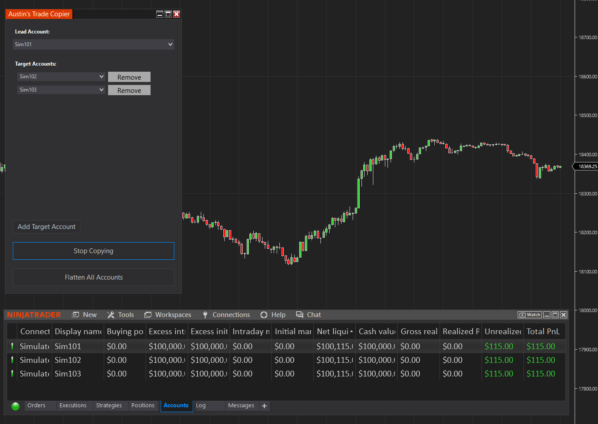

# Austin's Trade Copier

**Austin's Trade Copier** is a NinjaTrader 8 add-on that lets you mirror trades from one lead account to multiple target accounts in real time. Built for traders managing multiple accounts, it provides a simple UI and robust functionality to streamline account management.

---

---

## 🚀 Features

- 📈 **Trade Mirroring**: Automatically copies market, limit, and stop orders from a lead account to any number of target accounts.
- 🔁 **Live Sync**: Reacts to account connection status updates in real time.
- ✅ **Start/Stop Toggle**: One-click control to start or pause copying.
- 🧹 **Flatten All**: Instantly cancel all working orders and close open positions across accounts.
- ➕ **Add/Remove Target Accounts**: Dynamic combo box and layout to customize account pairs.
- 🖥️ **Clean UI**: Simple, effective WPF-based interface embedded in NinjaTrader.

---

## 🛠️ Installation

1. Copy `austins-trade-copier.cs` into your NinjaTrader 8 `AddOns` directory.
2. Open NinjaTrader, go to **NinjaScript Editor**, and press `F5` to compile.
3. Open the copier from **Control Center > Tools > Austin's Trade Copier**.

> ℹ️ The UI will appear automatically when the add-on is activated.

---

## 📋 How to Use

1. **Choose a Lead Account** – All trades originate here.
2. **Add Target Accounts** – These will copy the trades from the lead account.
3. Click **Start Copying** to begin trade mirroring.
4. Use **Stop Copying** to pause and automatically flatten if needed.
5. Use **Flatten All Accounts** anytime to cancel orders and exit all positions in all accounts (including lead).

---

## ⚠️ Warnings & Best Practices

- Only **connected accounts** are available for copying.
- **Lead account cannot also be a target account**.
- Only **filled orders** are copied—not partials or rejections.
- **Trade responsibly**—copied trades carry the same risk as manual entries.

---

## 📁 File Overview

- `austins-trade-copier.cs` – The complete NinjaScript AddOn source code.

---

## 📄 License

MIT License

Copyright (c) 2025 Austin Naremore

Permission is hereby granted, free of charge, to any person obtaining a copy
of this software and associated documentation files (the "Software"), to deal
in the Software without restriction, including without limitation the rights
to use, copy, modify, merge, publish, distribute, sublicense, and/or sell
copies of the Software, and to permit persons to whom the Software is
furnished to do so, subject to the following conditions:

The above copyright notice and this permission notice shall be included in all
copies or substantial portions of the Software.

THE SOFTWARE IS PROVIDED "AS IS", WITHOUT WARRANTY OF ANY KIND, EXPRESS OR
IMPLIED, INCLUDING BUT NOT LIMITED TO THE WARRANTIES OF MERCHANTABILITY,
FITNESS FOR A PARTICULAR PURPOSE AND NONINFRINGEMENT. IN NO EVENT SHALL THE
AUTHORS OR COPYRIGHT HOLDERS BE LIABLE FOR ANY CLAIM, DAMAGES OR OTHER
LIABILITY, WHETHER IN AN ACTION OF CONTRACT, TORT OR OTHERWISE, ARISING FROM,
OUT OF OR IN CONNECTION WITH THE SOFTWARE OR THE USE OR OTHER DEALINGS IN THE
SOFTWARE.

---

## 🙋 Feedback & Contributions

This is a personal tool built by Austin with lots of vibes. Feel free to submit new features, fixes, or report a bug in [Issues](https://github.com/anaremore/austins-trade-copier/issues).

> "Because one account isn't degenerate enough."