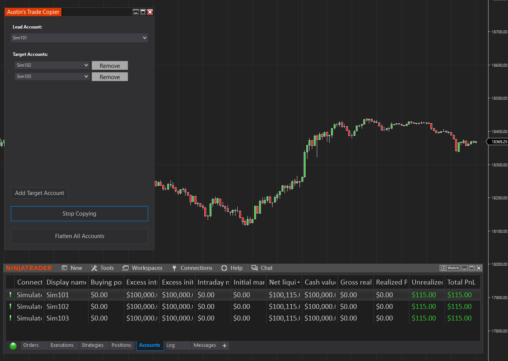

# Austin's Trade Copier

**Austin's Trade Copier** is a NinjaTrader 8 add-on that lets you mirror trades from one lead account to multiple target accounts in real time. Built for traders managing multiple accounts, it provides a simple UI and robust functionality to streamline account management.

---

---

## 🚀 Features

- 📈 **Trade Mirroring**: Automatically copies market, limit, and stop orders from a lead account to any number of target accounts.
- 🔁 **Live Sync**: Reacts to account connection status updates in real time.
- 🧭 **Follower Dashboard**: Manage accounts in a grid with connection status, copy state, position summary, session PnL, drawdown, sizing, risk rules, and last action.
- 🧩 **Account Groups**: Assign followers to groups such as funded, eval, personal, or provider-specific buckets, then enable, pause, flatten, or apply settings by group.
- 🎯 **Instrument Filters**: Restrict any follower or group to selected symbols such as `MNQ, MES`.
- ⚖️ **Per-Account Sizing**: Choose 1:1, multiplier, fixed quantity, balance-ratio, or disabled sizing for each follower.
- 🧱 **Max Net Position Guard**: Cap each follower's absolute resulting position per instrument.
- 🧯 **Risk Lockouts**: Set daily loss, drawdown, and profit-target thresholds per account with soft-lock or hard-flatten behavior.
- ✅ **Pause Without Flattening**: Pause copying without touching open positions; flatten actions are separate and confirmed.
- 🧹 **Flatten Controls**: Flatten followers, all accounts, or a selected group.
- 🧮 **Reconcile Selected**: Deliberately align selected followers to the lead using each row's sizing rules.
- 🧪 **Dry Run Mode**: Simulate copy and reconcile decisions without submitting copied/reconcile orders.
- 💾 **Profiles**: Save, load, and delete copier profiles so groups, sizing, and risk rules survive restarts.
- 📝 **Event Log**: Non-blocking panel log for copied orders, skipped orders, lockouts, and errors, with export and clear controls.

---

## 🛠️ Installation

1. Copy `austins-trade-copier.cs` into your NinjaTrader 8 `AddOns` directory.
2. Open NinjaTrader, go to **NinjaScript Editor**, and press `F5` to compile.
3. Open the copier from **Control Center > Tools > Austin's Trade Copier**.

> ℹ️ The UI will appear automatically when the add-on is activated.

---

## 📋 How to Use

1. **Choose a Lead Account** – All copied trades originate here.
2. **Add Follower Accounts** – Choose an account, assign a group name, then click **Add Account**.
3. **Configure Symbols and Sizing** – Leave **Symbols** blank to copy all instruments, or enter roots/full names such as `MNQ, MES`. Then pick a sizing mode per row:
   - **OneToOne**: copies the lead filled quantity.
   - **Multiplier**: copies `floor(lead filled quantity * multiplier)`.
   - **Fixed**: sends a fixed quantity once per lead order.
   - **BalanceRatio**: scales by follower equity versus lead equity.
   - **Disabled**: keeps the row visible but does not copy entries.
4. **Set Risk Rules** – Optional loss, drawdown, and profit-target values lock an account when hit.
5. **Save a Profile** – Store the current dashboard as a profile if you want to reuse the setup.
6. **Start Copying** – The dashboard validates active rows before arming and shows active, ready, locked, warning, desynced, and error states. Enable **Dry Run** first if you want to test the copy decisions without submitting copied orders.
7. **Pause Copying** – Pausing stops new copy processing and leaves positions untouched.
8. **Flatten or Reconcile Deliberately** – Use selected, follower, group, or all-account flatten buttons when you intend to close positions. Use **Reconcile Selected** only when you want selected followers adjusted back toward the lead.

---

## 🧠 Sizing and Risk Model

Sizing is calculated from the cumulative filled quantity of the lead order. This avoids over-copying partial fills: if the lead order fills in pieces, each follower receives only the remaining quantity needed for its configured target size.

Balance-ratio sizing uses `NetLiquidation` first and falls back to `CashValue`. If either account has missing or zero balance data, the copier skips that follower order instead of falling back to the full lead size.

`Max` caps every sizing mode when greater than zero. A value of `0` means no max cap.

`Max Net` caps the absolute resulting follower position per instrument. A value of `0` means no net-position cap. The guard blocks or caps exposure increases but still allows position-reducing orders.

Before copying starts, enabled rows are validated. Disconnected followers, zero multipliers, zero fixed quantities, or unavailable balance-ratio account values block startup instead of silently creating an unsafe copier state.

Profiles are stored under your NinjaTrader documents templates folder:

`Documents\NinjaTrader 8\templates\AustinTradeCopier`

Risk thresholds use the row baseline captured when the follower is added or when **Reset Baselines** is clicked:

- **Loss** locks when session PnL is less than or equal to the negative loss limit.
- **DD Lim** locks when drawdown from the row's session peak reaches the limit.
- **Target** locks when session PnL reaches the profit target.

Risk actions:

- **SoftLock** blocks new or increasing entries, but allows position-reducing exits. Exit quantity is capped so a locked account cannot reverse.
- **HardFlatten** immediately requests a flatten for the account, then blocks new or increasing entries.

Reconciliation is selected-row only and requires confirmation. Unlocked rows are adjusted toward the lead account using their configured sizing rules. Locked rows reconcile by reducing exposure only; they will not open or increase a position.

Dry run mode is selected before starting a copy session and stays locked for that session. In dry run, copied orders and reconcile adjustments are logged as simulated actions instead of being submitted. Manual flatten buttons remain real emergency controls.

---

## ⚠️ Warnings & Best Practices

- Only **connected accounts** are available for copying.
- **Lead account cannot also be a target account**.
- Filled and partially filled lead orders are tracked by cumulative filled quantity to avoid duplicate target orders.
- Soft-locked and manually locked accounts still allow exits that reduce an existing position.
- Balance-ratio sizing can skip a follower if NinjaTrader does not expose usable account value data.
- Always test new sizing and lockout rules in simulation before using live accounts.
- **Trade responsibly**—copied trades carry the same risk as manual entries.

---

## 📁 File Overview

- `austins-trade-copier.cs` – The complete NinjaScript AddOn source code.

---

## 📄 License

MIT License

Copyright (c) 2025 Austin Naremore

Permission is hereby granted, free of charge, to any person obtaining a copy
of this software and associated documentation files (the "Software"), to deal
in the Software without restriction, including without limitation the rights
to use, copy, modify, merge, publish, distribute, sublicense, and/or sell
copies of the Software, and to permit persons to whom the Software is
furnished to do so, subject to the following conditions:

The above copyright notice and this permission notice shall be included in all
copies or substantial portions of the Software.

THE SOFTWARE IS PROVIDED "AS IS", WITHOUT WARRANTY OF ANY KIND, EXPRESS OR
IMPLIED, INCLUDING BUT NOT LIMITED TO THE WARRANTIES OF MERCHANTABILITY,
FITNESS FOR A PARTICULAR PURPOSE AND NONINFRINGEMENT. IN NO EVENT SHALL THE
AUTHORS OR COPYRIGHT HOLDERS BE LIABLE FOR ANY CLAIM, DAMAGES OR OTHER
LIABILITY, WHETHER IN AN ACTION OF CONTRACT, TORT OR OTHERWISE, ARISING FROM,
OUT OF OR IN CONNECTION WITH THE SOFTWARE OR THE USE OR OTHER DEALINGS IN THE
SOFTWARE.

---

## 🙋 Feedback & Contributions

This is a personal tool built by Austin with lots of vibes. Feel free to submit new features, fixes, or report a bug in [Issues](https://github.com/anaremore/austins-trade-copier/issues).

> "Because one account isn't degenerate enough."
